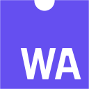
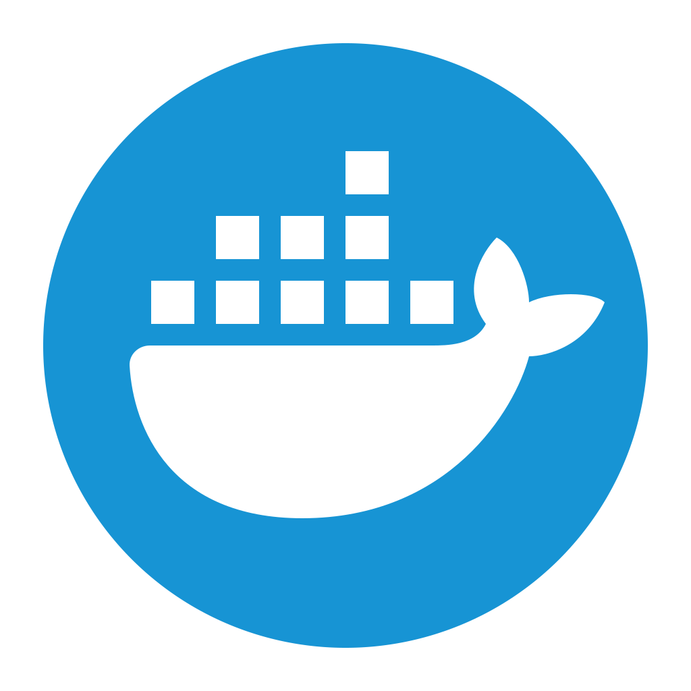

## table of contents

this repo is still a wip - bare with me while i populate it!

### projects

- [animalese](#animalese) (tauri, rust, svelte, typescript)
- [bert](#bert) (rust)
- [muter](#muter) (go)
- [pride-overlay](#pride-overlay) (rust, wasm)

### forks

- [snk](#snk) (typescript, docker)

### contributions

- [rust-clippy](#rust-clippy) (rust)
- [vault-rs](#vault-rs) (rust)

### challenges

- [advent of code](#advent-of-code) (rust)
- [project euler](#project-euler) (rust)

### other

- [salad](#salad) (nix)

## projects

### animalese [WIP]

> 🔔 play [animalese](https://nookipedia.com/wiki/Animalese) as you type

- [source code](https://github.com/isitreallyalive/animalese)

cross-platform tauri app to play animal crossing sound effects (primarily [animalese](https://nookipedia.com/wiki/Animalese)) while you type.

written using [tauri](https://tauri.app), [rust](https://rust-lang.org), [svelte](https://svelte.dev), and [typescript](https://typescriptlang.org).

   

### bert [WIP]

> 🐶 the modular discord bot that you'll love

- [source code](https://github.com/isitreallyalive/bert)

modular [discord](https://discord.com) bot that does things the right way. trust me, you'll love it.

the mascot is bert the dog. isn't he lovely?

this project is written in [rust](https://rust-lang.org) and uses the [serenity](https://github.com/serenity-rs/serenity) library to interact with the [discord](https://discord.com) api.

 

### muter

> 🪞 mirror system mutes across communication platforms!

- [repo](https://github.com/isitreallyalive/muter)

enables bidirectional mute synchronization between your system microphone and communication applications. currently only supports [vencord](https://vencord.dev), but contributions are welcome.

this project is written in [go](https://go.dev). the [vencord](https://vencord.dev) plugin is written in [typescript](https://typescriptlang.org).

 

### pride-overlay

> 🏳️‍⚧️ put pride flags on images!

- [repo](https://github.com/isitreallyalive/pride-overlay)
- [crates.io](https://crates.io/crates/pride-overlay)

rust crate to overlay pride flags on images. being rewritten to provide a more ergonomic api and wasm support.

this project is written in [rust](https://rust-lang.org) and compiles to [wasm](https://webassembly.org/).

 

## forks

### snk

> 🐍 custom fork of [platane/snk](https://github.com/platane/snk)

- [repo](https://github.com/isitreallyalive/snk)
- [original](https://github.com/platane/snk)

this fork introduces the `color_progress` option to change the colour of the progress bar. this can be seen in action at the bottom of my profile readme.

i attempted to contribute these changes upstream, however [my pr](https://github.com/Platane/snk/pull/155) was closed because the author didn't want to "introduce changes into the API", so i maintain it myself.

this project is written in [typescript](https://typescriptlang.org), but also make uses of [docker](https://docker.com).

 

## contributions

### rust-clippy

> A bunch of lints to catch common mistakes and improve your Rust code.

- [fork](https://github.com/isitreallyalive/rust-clippy)
- [upstream](https://github.com/rust-lang/rust-clippy)

i contributed a fix to the [`duplicated_attributes`](https://rust-lang.github.io/rust-clippy/master/index.html#duplicated_attributes) lint which allowed it to detect prefixed attributes, such as `clippy::lint_name` in [pr #15212](https://github.com/rust-lang/rust-clippy/pull/15212).

this project is written in [rust](https://rust-lang.org) and is an official project of [the rust programming language](https://github.com/rust-lang).

### vault-rs

> An asynchronous Rust client library for the Hashicorp Vault API

- [fork](https://github.com/isitreallyalive/vaultrs)
- [upstream](https://github.com/jmgilman/vaultrs)

i contributed the code for the [cubbyhole](https://developer.hashicorp.com/vault/api-docs/secret/cubbyhole) secret engine in [pr #131](https://github.com/jmgilman/vaultrs/pull/131).

this project is written in [rust](https://rust-lang.org) and was created by [Joshua Gilman](https://github.com/jmgilman).

## challenges

### advent of code

> 🎄 my advent of code solutions (2015-)

- [repo](https://github.com/isitreallyalive/aoc)
- [website](https://adventofcode.com)

all of my solutions are written in [rust](https://rust-lang.org).

### project euler

> ➕ my project euler solutions

- [repo](https://github.com/isitreallyalive/euler)
- [website](https://project-euler.net)

both my custom runner and all of my solutions are written in [rust](https://rust-lang.org).

## other

### salad

> ❄️ My NixOS configuration :]

- [repo](https://github.com/isitreallyalive/salad)
- [book](https://salad.newty.dev)

given that it is a nixos configuration, it is naturally written entirely in [nix](https://nixos.org).

